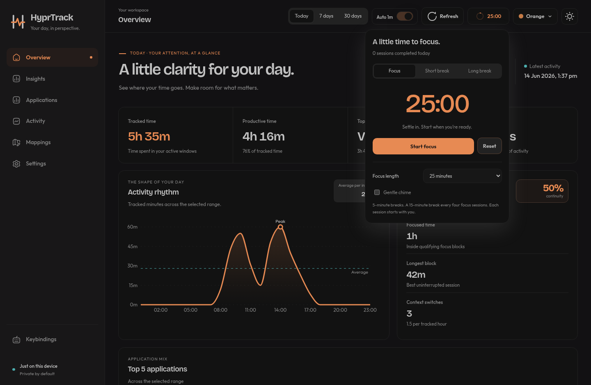

# HyprTrack Desktop

HyprTrack is a standalone Arch Linux desktop application for local Hyprland
activity tracking. The Tauri desktop app shows the dashboard and exports a
Python collector script that listens to Hyprland window events and writes timed
activity intervals to a local SQLite database.

No account, web server, or network service is required. All activity data stays
on your machine.

## Website and documentation

Explore the [HyprTrack website](https://hyprtrack-delta.vercel.app) for the
feature showcase, six-theme playground, focus timer, and release downloads.
The [handbook](https://hyprtrack-delta.vercel.app/docs) covers installation,
the collector, appearance, mappings, shortcuts, safe updates, and your data.

The public website is a separate Next.js project in [`next/`](next/README.md),
hosted on Vercel. It uses sample data and never connects to your desktop
activity database. For local development:

```bash
cd next
npm ci
npm run dev
```

## Screenshots

### Light mode


### Dark mode


### Pomodoro timer



## Supported Platform

- x86_64 Arch Linux
- Hyprland with a working `hyprctl`
- Python 3.10 or newer
- A working system tray/status notifier
- WebKitGTK and GTK runtime libraries

HyprTrack records application classes and window titles locally. The database
is not uploaded anywhere.

## Install On Arch Linux

The current release is `v2.1.0`. Download the AppImage into a permanent
location:

```bash
mkdir -p ~/.local/bin
wget -O ~/.local/bin/hyprtrack-desktop.AppImage \
  https://github.com/wrestle-R/HyprTrack/releases/download/v2.1.0/HyprTrack.Desktop_2.1.0_amd64.AppImage
chmod +x ~/.local/bin/hyprtrack-desktop.AppImage
~/.local/bin/hyprtrack-desktop.AppImage
```

The final command launches HyprTrack, registers **HyprTrack Desktop** in the
current user's application launcher with its icon, and exports the collector to:

```text
~/.local/bin/hyprtrack/collector/hyprtrack-monitor.py
```

The dashboard reads this database:

```text
~/.local/bin/hyprtrack/collector/hyprtrack.db
```

Keep the AppImage at this path if you want the launcher entry to keep working.
If you move the AppImage later, launch it manually from the new path once so
HyprTrack can refresh the desktop entry.

## Update Without Losing Activity Data

Replacing the AppImage updates the desktop application and exported collector
script. It does not replace or delete the existing activity database at:

```text
~/.local/bin/hyprtrack/collector/hyprtrack.db
```

Create a SQLite-safe backup first, then replace the AppImage. The commands
below also record the pre-update row count and integrity result so you can
confirm the same database is still healthy after the first `2.1.0` launch.
Change
`VERSION` to the release you want to install:

### Update From A Published Release

```bash
VERSION=2.1.0
mkdir -p ~/.local/share/hyprtrack-backups
database="$HOME/.local/bin/hyprtrack/collector/hyprtrack.db"
backup="$HOME/.local/share/hyprtrack-backups/hyprtrack-$(date +%Y%m%d-%H%M%S).db"
before_rows="$(sqlite3 "$database" "SELECT COUNT(*) FROM activity_samples;")"
before_integrity="$(sqlite3 "$database" "PRAGMA integrity_check;")"
sqlite3 "$database" ".backup '$backup'"

wget -O ~/.local/bin/hyprtrack-desktop.AppImage.new \
  "https://github.com/wrestle-R/HyprTrack/releases/download/v${VERSION}/HyprTrack.Desktop_${VERSION}_amd64.AppImage"
chmod +x ~/.local/bin/hyprtrack-desktop.AppImage.new
mv ~/.local/bin/hyprtrack-desktop.AppImage.new \
  ~/.local/bin/hyprtrack-desktop.AppImage
~/.local/bin/hyprtrack-desktop.AppImage

after_rows="$(sqlite3 "$database" "SELECT COUNT(*) FROM activity_samples;")"
after_integrity="$(sqlite3 "$database" "PRAGMA integrity_check;")"
printf 'Rows before update: %s\nRows after update:  %s\nIntegrity before:  %s\nIntegrity after:   %s\nBackup file:       %s\n' \
  "$before_rows" "$after_rows" "$before_integrity" "$after_integrity" "$backup"
```

Use this option only after that version has been published on the GitHub
Releases page.

If `Rows before update` and `Rows after update` match and both integrity
results are `ok`, the AppImage replacement kept the same
`~/.local/bin/hyprtrack/collector/hyprtrack.db` intact.

## Start Tracking From Hyprland

Add the collector to your Hyprland autostart config after launching the
AppImage once. If you use the custom Lua config loaded from
`~/.config/hypr/custom/execs.lua`, add this inside the
`hyprland.start` block:

```lua
hl.exec_cmd("$HOME/.local/bin/hyprtrack/collector/hyprtrack-monitor.py")
```

For a fresh `~/.config/hypr/custom/execs.lua`, the file can look like this:

```lua
hl.on("hyprland.start", function ()
    hl.exec_cmd("$HOME/.local/bin/hyprtrack/collector/hyprtrack-monitor.py")
end)
```

The collector keeps running after the desktop window is closed. It stores
timestamps in IST (`+05:30`), records active browser title changes immediately,
and uses a lock file beside the database to avoid duplicate writers.

## Desktop Features

- Overview, focus quality, personal insights, application rankings, and grouped activity sessions
- Editable title mappings that clean up current and historical dashboard labels
  without rewriting the SQLite database
- App-local keybindings with duplicate and unsafe-shortcut validation
- Six MultiCodex palettes: Sage, Ocean, Sand, Rose, Plum, and Orange, each in
  light, dark, or system mode, with animated appearance changes
- Compact persistent Pomodoro timer with pause/resume, 15/25/45/60-minute focus
  blocks, short and long breaks, daily session counts, and an optional chime
- Font-size, sidebar-width, date-range, and productive-label preferences
- Consistent VS Code labels, including historical `com.microsoft.VSCode` activity

Mappings and keybindings are stored locally with the desktop preferences.
Shortcuts work only while the HyprTrack window is focused. Super/Meta shortcuts
are intentionally unsupported so HyprTrack does not conflict with Hyprland
global bindings.

## Version History

### v2.1.0 — A clearer workspace, a little time to focus

Redesigns the desktop workspace with calmer navigation, a compact metric strip,
cleaner charts and tables, and a new appearance panel. Adds the same six palettes
as MultiCodex with light, dark, and system modes, circular theme transitions where
supported, and a gentle fade on older WebKit versions. Reduced-motion preferences
skip decorative animations.

The new compact Pomodoro timer remembers its deadline across navigation, hiding,
and reopening the app. Focus blocks are 15, 25, 45, or 60 minutes, with 5-minute
breaks and a 15-minute break after four completed focus sessions. Breaks start
manually, and the completion chime is optional. The timer does not need the
activity collector to run; completion sounds play while the app is running.

Normalizes `com.microsoft.VSCode` and other editor aliases to **VS Code** in current
and historical analytics. Existing activity rows remain unchanged. Preferences
upgrade in place, retaining custom mappings, keybindings, and selected productive
apps.

### v2.0.3 — Overview reads the day properly

Adds the Overview Top 5 application panel next to focus quality and lets the
7-day and 30-day rhythm chart drill into a selected day’s top applications.
The release keeps the existing local SQLite database and update flow intact.

### v0.2.0 — Release flow catches up with the dashboard

Ships the unreleased dashboard work since `v0.1.9`: default Notion and
Instagram mappings, more resilient analytics/loading states, the improved
responsive layouts, and a safer README upgrade flow that verifies the existing
collector database stays intact during AppImage replacement.

### v0.1.1 — The desktop era begins

HyprTrack moved from a separate Next.js dashboard and Python collector into a
standalone Tauri application with local SQLite storage, tray behavior, CI, and
release bundles. The project stopped being “a script plus a website” and
started pretending to be a proper desktop app.

### v0.1.2 — A desktop app should probably have an icon

Added desktop-launcher integration, the application icon, Arch-specific install
instructions, and the first light and dark screenshots. Turns out users enjoy
finding an installed application without launching it from a mystery path.

### v0.1.3 — Documentation learns the current version

Corrected the README installation URL and release references. Small release,
important lesson: documentation that confidently downloads the previous
version is technically documentation, but not particularly helpful.

### v0.1.4 — Packaging becomes reproducible

Added the Linux release builder, AppImage patching checks, automated packaging
tests, and SHA-256 manifests for AppImage, DEB, and RPM artifacts.

### v0.1.5 — Tracking survives the window

Separated collection from the GUI with a persistent `systemd --user` service,
service controls, coverage reporting, and restart diagnostics. Closing the
dashboard no longer meant accidentally clocking out.

### v0.1.6 — Back to Python, but intentionally

Replaced the service experiment with an exported event-driven Python collector
started by Hyprland. This kept recording independent from the GUI while making
installation, debugging, and title-change tracking substantially simpler.

### v0.1.7 — The dashboard gets controls

Added editable title mappings, app-local keybindings, preference migration,
font and sidebar sizing, productive-label controls, and refreshed screenshots.
Settings finally became settings instead of decorative suggestions.

### v0.1.8 — Personal analytics arrive

Added focus quality, configurable focus thresholds, period comparisons,
activity insights, a redesigned Activity rhythm chart, and a dedicated
Insights page. I remembered the analytics before remembering that a heatmap
also has to fit inside its own card.

### v0.1.9 — The UI remembers windows have different sizes

Rebuilt Weekly rhythm as a responsive activity rail, improved layouts across
narrow and wide windows, removed visible scrollbar clutter, restored the subtle
checker texture without the colored glow, and refreshed the README screenshots.

## Run From The CLI

Run the exported collector directly:

```bash
~/.local/bin/hyprtrack/collector/hyprtrack-monitor.py
```

Record one sample for testing:

```bash
~/.local/bin/hyprtrack/collector/hyprtrack-monitor.py --once
```

Use a different database:

```bash
~/.local/bin/hyprtrack/collector/hyprtrack-monitor.py --db /path/to/hyprtrack.db
```

## Inspect The Data

Using the SQLite command-line client:

```bash
sqlite3 ~/.local/bin/hyprtrack/collector/hyprtrack.db \
  "SELECT sampled_at, ended_at, last_seen_at, app_class, window_title FROM activity_samples ORDER BY sampled_at DESC LIMIT 20;"
```

Summarize completed duration by application:

```bash
sqlite3 ~/.local/bin/hyprtrack/collector/hyprtrack.db \
  "SELECT app_class, ROUND(SUM((julianday(COALESCE(ended_at, last_seen_at)) - julianday(sampled_at)) * 1440), 1) AS minutes FROM activity_samples WHERE COALESCE(ended_at, last_seen_at) IS NOT NULL GROUP BY app_class ORDER BY minutes DESC;"
```

## Uninstall

Quit HyprTrack from its tray menu and remove the AppImage, launcher, icon,
collector, and local dashboard data:

```bash
rm ~/.local/bin/hyprtrack-desktop.AppImage
rm ~/.local/share/applications/hyprtrack-desktop.desktop
rm ~/.local/share/applications/com.hyprtrack.desktop
rm ~/.local/share/icons/hicolor/128x128/apps/hyprtrack-desktop.png
rm -rf ~/.local/bin/hyprtrack
rm -rf ~/.local/share/com.hyprtrack.desktop
```

Remove the Hyprland `hl.exec_cmd(...)` line manually from your exec config if
you added it.

## Troubleshooting

- No new activity: verify the collector is running with
  `pgrep -af hyprtrack-monitor.py`.
- Hyprland connection errors: verify `hyprctl activewindow -j` works in the
  same session.
- Duplicate collector warning: stop the older `hyprtrack-monitor.py` process
  before starting another one against the same database.
- App starts but has no tray icon: enable a StatusNotifier-compatible tray.

## License

HyprTrack is available under the [MIT License](LICENSE).
