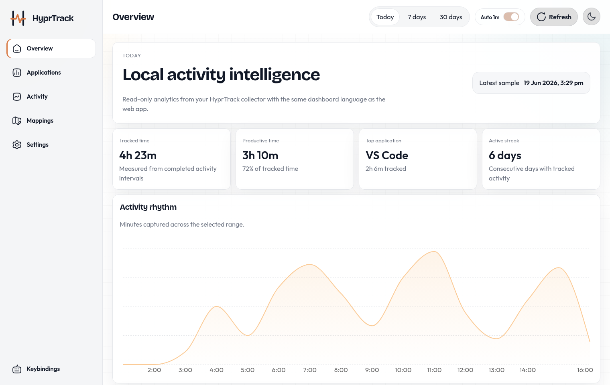
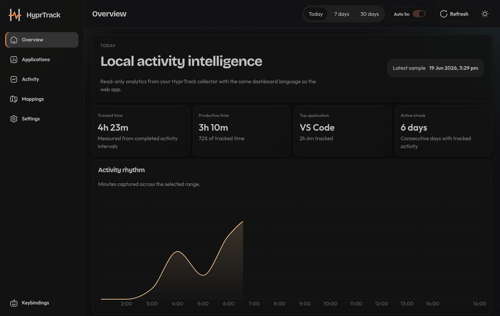

# HyprTrack Desktop

HyprTrack is a standalone Arch Linux desktop application for local Hyprland
activity tracking. The Tauri desktop app shows the dashboard and exports a
Python collector script that listens to Hyprland window events and writes timed
activity intervals to a local SQLite database.

No account, web server, or network service is required. All activity data stays
on your machine.

## Screenshots

### Light mode



### Dark mode



## Supported Platform

- x86_64 Arch Linux
- Hyprland with a working `hyprctl`
- Python 3.10 or newer
- A working system tray/status notifier
- WebKitGTK and GTK runtime libraries

HyprTrack records application classes and window titles locally. The database
is not uploaded anywhere.

## Install On Arch Linux

The current release is `v0.1.8`. Download the AppImage into a permanent
location:

```bash
mkdir -p ~/.local/bin
wget -O ~/.local/bin/hyprtrack-desktop.AppImage \
  https://github.com/wrestle-R/HyprTrack/releases/download/v0.1.8/HyprTrack.Desktop_0.1.8_amd64.AppImage
chmod +x ~/.local/bin/hyprtrack-desktop.AppImage
~/.local/bin/hyprtrack-desktop.AppImage
```

The final command launches HyprTrack, registers **HyprTrack Desktop** in the
current user's application launcher with its icon, and exports the collector to:

```text
~/.local/bin/hyprtrack/collector/hyprtrack-monitor.py
```

The dashboard reads this database:

```text
~/.local/bin/hyprtrack/collector/hyprtrack.db
```

Keep the AppImage at this path if you want the launcher entry to keep working.
If you move the AppImage later, launch it manually from the new path once so
HyprTrack can refresh the desktop entry.

## Start Tracking From Hyprland

Add the collector to your Hyprland autostart config after launching the
AppImage once. If you use the custom Lua config loaded from
`~/.config/hypr/custom/execs.lua`, add this inside the
`hyprland.start` block:

```lua
hl.exec_cmd("$HOME/.local/bin/hyprtrack/collector/hyprtrack-monitor.py")
```

For a fresh `~/.config/hypr/custom/execs.lua`, the file can look like this:

```lua
hl.on("hyprland.start", function ()
    hl.exec_cmd("$HOME/.local/bin/hyprtrack/collector/hyprtrack-monitor.py")
end)
```

The collector keeps running after the desktop window is closed. It stores
timestamps in IST (`+05:30`), records active browser title changes immediately,
and uses a lock file beside the database to avoid duplicate writers.

## Desktop Features

- Overview, focus quality, personal insights, application rankings, and grouped activity sessions
- Editable title mappings that clean up current and historical dashboard labels
  without rewriting the SQLite database
- App-local keybindings with duplicate and unsafe-shortcut validation
- Light, dark, font-size, sidebar-width, date-range, and productive-label
  preferences

Mappings and keybindings are stored locally with the desktop preferences.
Shortcuts work only while the HyprTrack window is focused. Super/Meta shortcuts
are intentionally unsupported so HyprTrack does not conflict with Hyprland
global bindings.

## Run From The CLI

Run the exported collector directly:

```bash
~/.local/bin/hyprtrack/collector/hyprtrack-monitor.py
```

Record one sample for testing:

```bash
~/.local/bin/hyprtrack/collector/hyprtrack-monitor.py --once
```

Use a different database:

```bash
~/.local/bin/hyprtrack/collector/hyprtrack-monitor.py --db /path/to/hyprtrack.db
```

## Inspect The Data

Using the SQLite command-line client:

```bash
sqlite3 ~/.local/bin/hyprtrack/collector/hyprtrack.db \
  "SELECT sampled_at, ended_at, last_seen_at, app_class, window_title FROM activity_samples ORDER BY sampled_at DESC LIMIT 20;"
```

Summarize completed duration by application:

```bash
sqlite3 ~/.local/bin/hyprtrack/collector/hyprtrack.db \
  "SELECT app_class, ROUND(SUM((julianday(COALESCE(ended_at, last_seen_at)) - julianday(sampled_at)) * 1440), 1) AS minutes FROM activity_samples WHERE COALESCE(ended_at, last_seen_at) IS NOT NULL GROUP BY app_class ORDER BY minutes DESC;"
```

## Uninstall

Quit HyprTrack from its tray menu and remove the AppImage, launcher, icon,
collector, and local dashboard data:

```bash
rm ~/.local/bin/hyprtrack-desktop.AppImage
rm ~/.local/share/applications/hyprtrack-desktop.desktop
rm ~/.local/share/applications/com.hyprtrack.desktop
rm ~/.local/share/icons/hicolor/128x128/apps/hyprtrack-desktop.png
rm -rf ~/.local/bin/hyprtrack
rm -rf ~/.local/share/com.hyprtrack.desktop
```

Remove the Hyprland `hl.exec_cmd(...)` line manually from your exec config if
you added it.

## Troubleshooting

- No new activity: verify the collector is running with
  `pgrep -af hyprtrack-monitor.py`.
- Hyprland connection errors: verify `hyprctl activewindow -j` works in the
  same session.
- Duplicate collector warning: stop the older `hyprtrack-monitor.py` process
  before starting another one against the same database.
- App starts but has no tray icon: enable a StatusNotifier-compatible tray.

## License

HyprTrack is available under the [MIT License](LICENSE).
